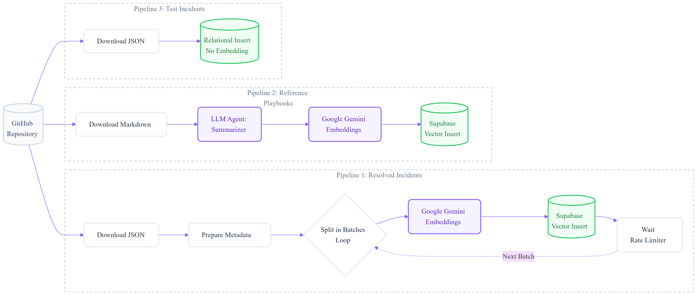
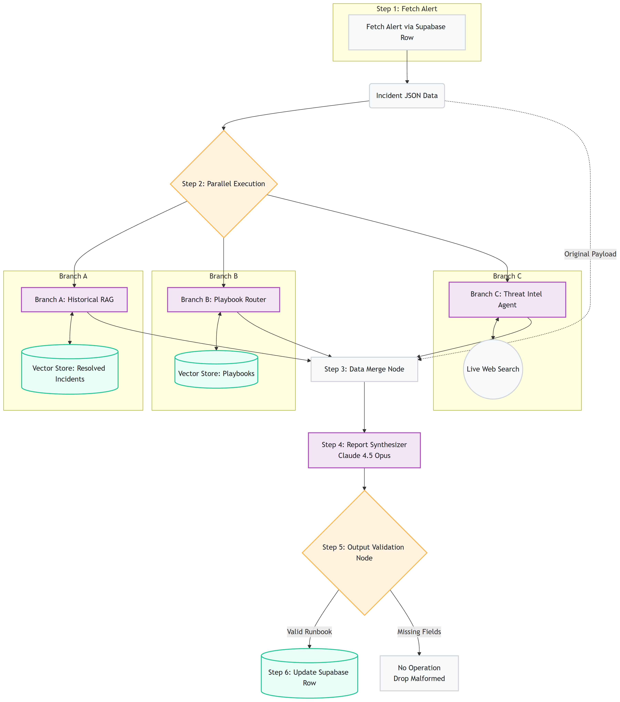

# 🏗️ Architecture: How It Works

The Incident-to-Runbook pipeline is designed as a multi-agent RAG (Retrieval-Augmented Generation) system. It relies heavily on strict structured outputs and parallel execution to minimize latency.

---

## 1. The Data Ingestion Pipeline

Before an incident can be triaged, the system must build its knowledge base. 

We use `models/gemini-embedding-001` for generating embeddings. Its vector space provides exceptionally high semantic fidelity when matching incoming incident descriptions against historical tickets.

### Rate Limiting & Resilience
To ensure smooth ingestion without hitting API limits (especially on free-tier embedding providers), the Resolved Incident pipeline uses a `SplitInBatches` node paired with a `Wait` node. This throttles the throughput, preventing `429 Too Many Requests` errors while ensuring zero data loss during the initial vector load.

---

## 2. The Incident Retrieval & Synthesis Pipeline

When a new incident arrives (via DB fetch), the core workflow triggers a 6-step pipeline.

### Step 1: Fetch
The payload is ingested. The workflow contract expects a strictly normalized JSON schema containing the `alert_source`, `rule_name`, `description`, and `entities`.

### Step 2: Parallel Execution
The payload is broadcast simultaneously to three specialized branches to minimize overall execution latency:

1. **Branch A (Historical RAG):** Queries the Supabase vector store for the 3 most similar past resolved incidents. It extracts how the team handled them, what the root cause was, and any lessons learned.
2. **Branch B (Playbook Routing):** Queries the vector store to find the most relevant Markdown playbook (e.g., "Ransomware Response" vs. "IAM Compromise"). It extracts the required containment steps.
3. **Branch C (Threat Intel):** An AI Agent uses Tavily to search the live web for context regarding the specific alert rule, CVE, or threat actor mentioned in the incident.

### Step 3: Data Merge
The outputs from all three branches are concatenated into a single, massive JSON object containing the full operational context of the incident.

### Step 4: Report Synthesis
The merged context is passed to the **Runbook Synthesizer** (powered by `anthropic/claude-opus-4.5`). This model acts as the senior analyst, reading the context and drafting the final response. 

To prevent hallucinations, the Synthesizer is hard-coded with a **Trust Hierarchy**:
1. **Playbooks:** The absolute ground truth. If a playbook says to isolate a host, the runbook must include that action.
2. **Historical Incidents:** Strong directional evidence of what worked in the past.
3. **Threat Intel:** Advisory context for enrichment.
4. **LLM Reasoning:** Used *only* to glue the data together, never to invent new containment strategies.

### Step 5 & 6: Structured Validation & Output
To be useful to a SOC team, an AI tool must be predictable. 

The Synthesizer does not output raw markdown text. It uses a **Structured Output Parser** to force the LLM to return a strict JSON object. Immediately following the parser, an n8n `If` node validates the output. If the `incident_summary` or `immediate_actions` fields are missing, the payload is dropped to prevent sending malformed data to the SIEM or ticketing system.

Only fully-validated, 8-section runbooks are written to the database.
